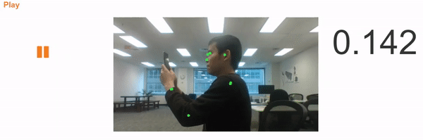

# UPRIGHT ⬆
A fast real-time posture detection app run in modern browsers, powered by [TensorFlow](https://js.tensorflow.org/).

Try the live demo: https://aunz.github.io/ds-upright/

---
#### Requirement
- Firefox or Chrome browser (desktop)
- Permission to access webcam

---
### Why?
- We spend on average ~10 hours per day on computers, phone, TV and usually in a suboptimal posture ☹.
- This can cause health problems and leads to lower productivity.
- **Solution**: a web app to track your posture and notify you when you deviate from the "optimal" posture or have been sitting for too long.

---
### Tech stacks
- Python
- Numpy
- Keras
- TensorFlow
- Convolution neural network
- PoseNet
- JavaScript
- HTML5 Media Stream API

---
### Work flow

#### Data

The data were acquired by recording participants showing various poses with some classified as "good" and some as "bad". *Disclaimer: the classification is not medically certified.*

Recorded video frames were extracted into images and labelled accordingly.

#### Training

Data were split into a training set (6000 images) and a validation set (2000 images)

**Method 1**

Raw images were resized to 134 × 240, turned into gray scale through a data generator and fed to CNN using Keras with TensorFlow as backend.

Several CNN architectures were tried. Layers included Conv2D, MaxPooling2D, BatchNormalisation, Dropout

**Method 2**

Key points (such as eyes, nose, ankles) were extracted from raw images using PoseNet and saved into json files. The coordinates (x, y) of these points are used to for training a linear regression model, and a neural network model. The coordinates were also turned back into 2D images and fed into a CNN model.

Training and model evaluation were performed using Jupyter notebook on Colab.

The models were converted to a JavaScript compatible format and deployed on browsers.

---
### Road map 🗺
- Multi-people support
- Notification system: text message, push notification
- Mobile device support 📱
- Medically certified labels 👨‍⚕️
- Accuracy improvement 📈
- Data at various angles
- Gamification 🎮

---
*This project is part of the [Insight Data Science](http://insightdatascience.com/) Fellowship*
